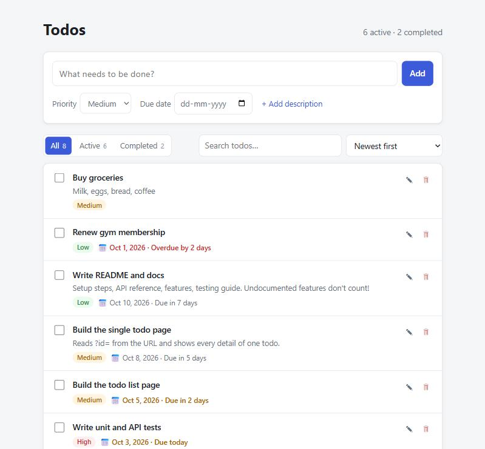

# Ziptrrip Todo App

A full-stack todo application built for the Ziptrrip tech assignment.

- **Backend:** Node.js + Express 5 + TypeScript REST API, SQLite database, Zod validation, 99 tests, REST Client + Postman files
- **Frontend:** React 19 + Vite as a **Multi-Page Application (MPA)** with two pages: the todo list (`index.html`) and a single todo (`todo.html?id=<id>`)



---

## Table of contents

- [Quick start](#quick-start)
- [Features](#features)
- [Tech stack](#tech-stack)
- [Project structure](#project-structure)
- [Running the project](#running-the-project)
- [Configuration](#configuration)
- [Scripts](#scripts)
- [API overview](#api-overview)
- [Data model](#data-model)
- [Testing](#testing)
- [Documentation](#documentation)
- [Assignment checklist](#assignment-checklist)

---

## Quick start

Requires **Node.js 20+** (developed on Node 22 LTS) and Git.

```bash
git clone https://github.com/Rahul-Bhati/ziptrrip.git
cd ziptrrip
npm install
npm run seed
npm run dev
```

- `npm install` at the root also installs the `server/` and `client/` dependencies.
- `npm run seed` adds 8 sample todos (optional).
- `npm run dev` starts the API on **http://localhost:3000** and the frontend on **http://localhost:5173**.

Open **http://localhost:5173**.

## Features

| Area | Features |
|---|---|
| **List page** | Add (title, priority, due date, description) · mark completed · inline title edit · delete · filter tabs with counts (All / Active / Completed) · debounced search in title + description · sort (newest, oldest, due date, priority, title) · clear completed · filters kept in the URL · overdue / due-soon highlighting · loading, error and empty states |
| **Todo page** | Opened with `todo.html?id=<id>` · all details incl. ID, created/updated timestamps and relative times · mark completed/active · edit every field (only changed fields sent) · server field errors under inputs · unsaved-changes warning · delete · back link keeps list filters · invalid/unknown id messages |
| **API** | CRUD + clear completed · filter/search/sort query params · counts with every list · partial updates (PATCH) · consistent JSON success/error format · correct status codes |
| **Quality** | Validation with all errors at once · DB constraints as a second line of defense · SQL-injection-safe queries · no internal details leaked on errors · graceful shutdown · race-safe data loading · timezone-safe due dates · dark mode · keyboard and screen-reader friendly |

**Full feature list with details: [docs/FEATURES.md](docs/FEATURES.md).**

## Tech stack

| Layer | Technology | Why |
|---|---|---|
| Language | TypeScript (strict) | Type safety; frontend reuses the server's `Todo` types |
| Server | Express 5 | Widely known and minimal; v5 forwards errors from `async` handlers |
| Database | SQLite via `better-sqlite3` | Real SQL database in a single file: nothing to install for reviewers |
| Validation | Zod | Runtime validation + TypeScript types from one schema |
| Frontend | React 19 + Vite 8 (multi-page build) | One HTML file per page → real MPA, fast dev server |
| Testing | Vitest + Supertest | Native TypeScript/ESM; API tests without opening a port |

Reasoning and rejected alternatives for every choice: [docs/BUILD_LOG.md](docs/BUILD_LOG.md#overall-stack-decisions).

## Project structure

```
ziptrrip/
├── package.json                  # root scripts: install / dev / build / start / test both apps
├── README.md
├── docs/
│   ├── FEATURES.md               # every feature, by area
│   ├── API.md                    # API reference
│   ├── TESTING.md                # tests, REST Client, Postman
│   ├── BUILD_LOG.md              # step-by-step build decisions
│   └── screenshots/
├── server/                       # backend: Express + TypeScript + SQLite
│   ├── src/
│   │   ├── index.ts              # entry: open DB, start server, graceful shutdown
│   │   ├── app.ts                # createApp(db): wires all layers together
│   │   ├── config.ts             # PORT, DB_PATH, CLIENT_DIST_PATH
│   │   ├── errors.ts             # AppError, NotFoundError (404), ValidationError (400)
│   │   ├── types/todo.ts         # Todo type + allowed values (shared with the client)
│   │   ├── routes/               # URL → controller
│   │   ├── controllers/          # HTTP in/out: status codes, response shape
│   │   ├── services/             # business logic: validate → repository → errors
│   │   ├── validation/           # Zod schemas + parse()
│   │   ├── repositories/         # all SQL lives here
│   │   ├── db/                   # SQLite connection + schema
│   │   ├── middleware/           # error handler, 404 handler, request logger
│   │   └── scripts/seed.ts       # sample data
│   ├── tests/                    # unit + API tests
│   ├── requests.http             # VS Code REST Client requests
│   └── postman/                  # Postman collection (with tests)
└── client/                       # frontend: React + Vite, multi-page
    ├── index.html                # page 1: todo list
    ├── todo.html                 # page 2: single todo (todo.html?id=<id>)
    ├── vite.config.ts            # MPA inputs + /api proxy
    └── src/
        ├── pages/list/           # ListPage, AddTodoForm, Toolbar, TodoItem, useTodoList
        ├── pages/todo/           # TodoPage, TodoDetails, EditTodoForm
        ├── components/           # PriorityBadge, DueDateLabel, ErrorBanner
        ├── api/                  # fetch wrapper (ApiError) + one function per endpoint
        ├── lib/                  # dates, URLs, change detection, options (+ tests)
        ├── hooks/                # useDebouncedValue
        ├── types.ts              # re-exports the server's types
        └── styles.css
```

Backend request flow:

```
HTTP request → route → controller → service (validates) → repository (SQL) → SQLite
                                        └── errors → error middleware → { error: { code, message, details } }
```

## Running the project

### Development

```bash
npm run dev
```

Runs both apps together (via `concurrently`):

| App | URL | Notes |
|---|---|---|
| Frontend (Vite) | http://localhost:5173 | Hot reload; forwards `/api/*` to the API |
| API (Express) | http://localhost:3000/api | Restarts on file changes; logs each request |

Or run them separately in two terminals: `npm run dev --prefix server` and `npm run dev --prefix client`.

### Production

```bash
npm run build
npm start
```

`build` compiles the server (TypeScript → `server/dist`) and the client (`client/dist`, after a type check). `start` runs **one** Express server that serves both the API and the built pages:

- http://localhost:3000/ (list page)
- http://localhost:3000/todo.html?id=1 (todo page)
- http://localhost:3000/api/todos (API)

### Sample data

```bash
npm run seed
```

Adds 8 sample todos with different priorities and due dates (overdue, today, upcoming), only if the database is empty. `npm run seed -- --force` adds them anyway.

## Configuration

Optional environment variables for the server:

| Variable | Default | Description |
|---|---|---|
| `PORT` | `3000` | HTTP port |
| `DB_PATH` | `server/data/todos.db` | SQLite database file (created automatically) |
| `CLIENT_DIST_PATH` | `client/dist` | Built frontend served in production |

Example: `PORT=4000 npm start` (PowerShell: `$env:PORT=4000; npm start`).

To reset all data, stop the server and delete the `server/data/` folder.

## Scripts

From the **root** folder:

| Command | What it does |
|---|---|
| `npm install` | Installs root, server and client dependencies |
| `npm run dev` | Starts API + frontend in development mode |
| `npm run build` | Builds server and client for production |
| `npm start` | Starts the production server (API + built pages) |
| `npm test` | Runs all server and client tests |
| `npm run typecheck` | Type-checks server and client |
| `npm run seed` | Adds sample todos |

Inside `server/`: also `npm run test:watch` and `npm run test:coverage`. Inside `client/`: `npm run preview` (serve the built client with Vite).

## API overview

| Method | Endpoint | Description | Success |
|---|---|---|---|
| `GET` | `/api/health` | Health check | `200` |
| `GET` | `/api/todos?status=&search=&sortBy=&order=` | List todos + counts | `200` |
| `GET` | `/api/todos/:id` | Get one todo | `200` |
| `POST` | `/api/todos` | Create a todo | `201` |
| `PATCH` | `/api/todos/:id` | Update some fields | `200` |
| `DELETE` | `/api/todos/:id` | Delete a todo | `204` |
| `DELETE` | `/api/todos/completed` | Delete all completed todos | `200` |

```bash
curl -X POST http://localhost:3000/api/todos -H "Content-Type: application/json" -d "{\"title\":\"Buy milk\",\"priority\":\"high\",\"dueDate\":\"2026-10-10\"}"
```

Success responses: `{ "data": ... }`. Errors: `{ "error": { "code", "message", "details?" } }`.

**Full reference with examples, validation rules and error codes: [docs/API.md](docs/API.md).**

## Data model

Table `todos` (SQLite):

| Field (API) | Column (DB) | Type | Notes |
|---|---|---|---|
| `id` | `id` | integer | Auto-increment; never reused after a delete |
| `title` | `title` | text | Required, 1–200 characters |
| `description` | `description` | text | Max 2000 characters, defaults to `""` |
| `completed` | `completed` | boolean (stored as 0/1) | Defaults to `false` |
| `priority` | `priority` | `"low"` \| `"medium"` \| `"high"` | Defaults to `"medium"` |
| `dueDate` | `due_date` | `"YYYY-MM-DD"` or `null` | Must be a real calendar date |
| `createdAt` | `created_at` | ISO 8601 timestamp | Set on create |
| `updatedAt` | `updated_at` | ISO 8601 timestamp | Updated on every change |

## Testing

```bash
npm test
```

| Suite | Tests | What |
|---|---|---|
| Server: unit | repository, validation schemas, service | SQL behaviour, every validation edge case, business rules |
| Server: API | every endpoint via Supertest | Status codes, response bodies, headers, error handling |
| Client: unit | dates, URLs, change detection, list options | Due-date maths, id parsing, PATCH diffing, URL state |

**136 tests in total (99 server + 37 client), ~97% server line coverage.** Each server test uses its own in-memory database, so no setup is needed.

Manual API testing: `server/requests.http` (VS Code REST Client) or import `server/postman/ziptrrip-todos.postman_collection.json` into Postman (19 requests, each with test assertions).

Details: [docs/TESTING.md](docs/TESTING.md).

## Documentation

| Document | Contents |
|---|---|
| [docs/FEATURES.md](docs/FEATURES.md) | Every feature of the app, by area, with screenshots |
| [docs/API.md](docs/API.md) | Every endpoint: parameters, examples, status codes, errors, validation rules |
| [docs/TESTING.md](docs/TESTING.md) | Running tests, what is covered, REST Client and Postman usage |
| [docs/BUILD_LOG.md](docs/BUILD_LOG.md) | How the project was built step by step: what, why, and which alternatives were rejected |

## Assignment checklist

| Requirement | Where | Status |
|---|---|---|
| React application | `client/` | ✅ |
| Multiple page application (MPA), not SPA | `client/index.html` + `client/todo.html`, two Vite build inputs, links cause full page loads | ✅ |
| Page for the todo list with features | `client/src/pages/list/`, see [FEATURES.md](docs/FEATURES.md#todo-list-page-indexhtml) | ✅ |
| Page for a single todo, receiving the todo id as a query parameter | `client/todo.html?id=<id>`, `client/src/pages/todo/` | ✅ |
| JavaScript / TypeScript server | `server/` (Express + TypeScript) | ✅ |
| CRUD APIs for todos | `server/src/routes`, [docs/API.md](docs/API.md) | ✅ |
| Save data in a file or database | SQLite (`server/src/db`, `server/src/repositories`) | ✅ |
| Unit tests | `server/tests`, `client/src/lib/*.test.ts` | ✅ |
| Postman / REST Client files | `server/postman/`, `server/requests.http` | ✅ |
| Code in a git repository | https://github.com/Rahul-Bhati/ziptrrip | ✅ |
| Features documented in `.md` files | `README.md`, `docs/FEATURES.md`, `docs/API.md`, `docs/TESTING.md` | ✅ |
| Extra: TypeScript | Entire project, strict mode | ✅ |
| Extra: Database | SQLite | ✅ |
| Extra: Code organisation | Layered backend (routes / controllers / services / repositories), pages / components / api / lib on the frontend | ✅ |
| Extra: Unit tests | 136 tests | ✅ |
| Extra: Postman / REST Client files | Both, Postman with assertions | ✅ |
