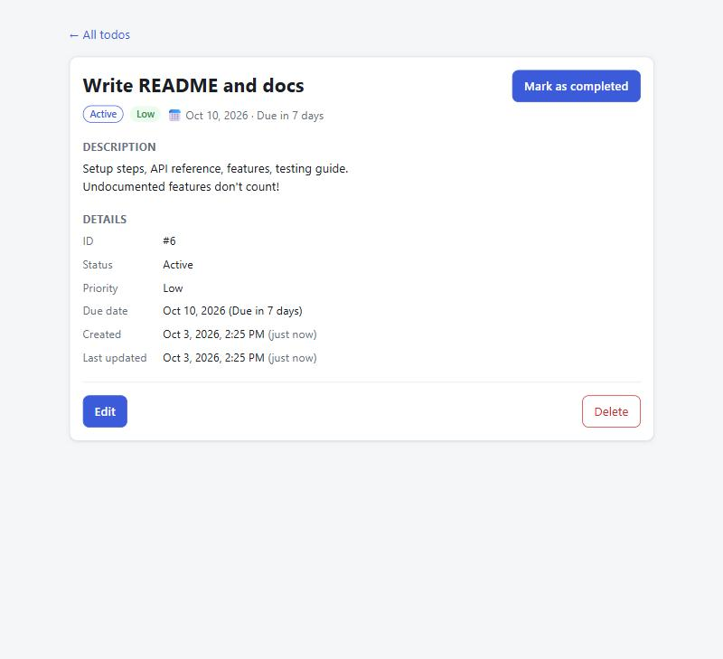

# Features

Every feature of the application, by area. (The assignment states that undocumented features are not considered, so this list is meant to be complete.)

## Contents

- [Todo list page](#todo-list-page-indexhtml)
- [Single todo page](#single-todo-page-todohtmlidid)
- [Multi-page application (MPA)](#multi-page-application-mpa)
- [REST API](#rest-api)
- [Data and validation](#data-and-validation)
- [Reliability and security](#reliability-and-security)
- [Developer experience](#developer-experience)

---

## Todo list page (`index.html`)

| Feature | Details |
|---|---|
| **Add a todo** | Title (required, max 200 chars), priority (low / medium / high, default medium), optional due date, optional description (revealed with "+ Add description"). Press Enter or click Add. Focus returns to the title box for quick entry. |
| **Mark completed / active** | Checkbox on each row. Completed todos are struck through. |
| **Inline title edit** | ✎ button → edit in place. Enter or Save to save, Escape or Cancel to cancel. |
| **Delete** | 🗑 button with a confirmation dialog. |
| **Filter by status** | Tabs: All / Active / Completed, each showing its live count. |
| **Search** | Case-insensitive, matches title **or** description. Debounced (one request after typing stops for 300 ms). |
| **Sort** | Newest first (default), oldest first, due date (soonest; todos without a date last), priority (high → low), title (A → Z, case-insensitive). |
| **Clear completed** | Deletes all completed todos at once, with confirmation. Shows how many will be deleted. |
| **Counts** | Header shows "X active · Y completed" for all todos, regardless of the current filter. |
| **Filters kept in the URL** | e.g. `/?status=active&search=milk&sort=priority-desc`. Reload, the back button, and shared links restore the same view. Invalid values in the URL fall back to defaults. |
| **Due date status** | Each due date shows a relative description: "Overdue by 2 days" (red), "Due today" / "Due tomorrow" / "Due in 2 days" (orange), "Due in 7 days". Completed todos are never shown as overdue. |
| **Description preview** | First line of the description under the title (full text on the todo page). |
| **Link to details** | Each title is a link to its own page: `todo.html?id=<id>`. |
| **States** | Loading message; error banner with **Retry**; dismissible banner for failed actions; empty states ("Nothing to do yet" / "No todos match your filters" + **Clear filters**). |
| **No double submits** | Buttons are disabled while their request is running. |

## Single todo page (`todo.html?id=<id>`)

| Feature | Details |
|---|---|
| **Todo id from the query parameter** | `todo.html?id=6` loads todo 6, as the assignment requires. |
| **All information about the todo** | Title, status badge (Active / Completed), priority, due date with relative description, full description (line breaks kept), ID, created and last-updated timestamps (local date and time + relative, e.g. "4 minutes ago"). |
| **Mark as completed / active** | One button; the page updates immediately from the server's response. |
| **Edit every field** | Title, description (with character counter), priority, due date (clear it to remove), completed. Only changed fields are sent. Saving with no changes just closes the form. |
| **Server validation messages** | Errors returned by the API appear under the matching field. |
| **Unsaved changes warning** | Leaving the page (link, reload, closing the tab) with unsaved edits triggers the browser's "Leave site?" confirmation. |
| **Delete** | With confirmation, then returns to the list. |
| **Back to the list with filters** | "← All todos" returns to the exact list view you came from (status, search, sort). Opened from a bookmark, it goes to the default list. |
| **Tab title** | The browser tab shows the todo's title. |
| **Missing / invalid / unknown id** | `todo.html`, `?id=abc` → "This link has no valid todo id"; `?id=999` → "Todo #999 was not found. It may have been deleted." Both with a link back to the list. |

## Multi-page application (MPA)

- Two real HTML pages: `index.html` and `todo.html`, each with its own entry script and its own JavaScript bundle (shared code like React goes in a common chunk the browser caches).
- Navigation between pages uses normal links, so every navigation is a **full page load**. No client-side router.
- In production both pages are served by the Express server (`npm start`) at `http://localhost:3000/` and `http://localhost:3000/todo.html?id=<id>`.

## REST API

Full reference: [API.md](API.md).

| Feature | Details |
|---|---|
| CRUD endpoints | `GET /api/todos`, `GET /api/todos/:id`, `POST /api/todos`, `PATCH /api/todos/:id`, `DELETE /api/todos/:id` |
| Bulk delete | `DELETE /api/todos/completed` returns how many were deleted |
| Filter, search, sort | `status`, `search`, `sortBy`, `order` query parameters on the list endpoint |
| Counts | `stats` (total / active / completed) returned with every list |
| Partial updates | `PATCH` changes only the fields sent; `dueDate: null` removes a due date |
| Correct status codes | `200`, `201` (+ `Location` header), `204`, `400`, `404`, `413`, `500` |
| One response format | Success: `{ "data": … }`. Error: `{ "error": { "code", "message", "details" } }` |
| Health check | `GET /api/health` |

## Data and validation

| Feature | Details |
|---|---|
| SQLite database | Single file `server/data/todos.db`, created automatically. Data survives restarts. |
| Validation (Zod) | Every input checked: id, body fields, query parameters. **All problems reported at once**, each with its field name. |
| Rules | Title 1–200 chars (trimmed); description ≤ 2000 chars; priority low/medium/high; due date a real calendar date `YYYY-MM-DD` (leap years checked) or null; `completed` a real boolean; unknown fields rejected. |
| Defaults | New todos: priority medium, empty description, no due date, not completed. |
| Database constraints | Second line of defense: `CHECK` constraints for non-blank title, valid priority, valid date, 0/1 completed. |
| Stable ids | Ids of deleted todos are never reused, so an old link never shows a different todo. |
| Timestamps | `createdAt` set once; `updatedAt` refreshed on every change (ISO 8601, UTC). |

## Reliability and security

- **SQL injection safe:** all values are bound parameters; sort columns come from a fixed allow-list.
- **No internal details leaked:** unexpected errors return a generic `500`; details are only logged on the server.
- **Invalid JSON and oversized bodies** get clear `400` / `413` responses.
- `X-Powered-By` header disabled.
- **Graceful shutdown:** on Ctrl+C / SIGTERM the server finishes in-flight requests and closes the database cleanly.
- **Race-safe frontend:** outdated requests are cancelled (AbortController), so a slow old response can't overwrite newer results.
- **Timezone-safe due dates:** calendar dates are compared as dates, not as UTC timestamps, so they never shift by a day.

## Developer experience

- **One command setup:** `npm install` at the root installs server and client.
- **One command dev:** `npm run dev` runs the API (port 3000) and the frontend (port 5173) together; the frontend proxies `/api` to the API.
- **Sample data:** `npm run seed` adds 8 example todos (only if the database is empty).
- **Tests:** 136 automated tests (99 server: unit + API; 37 client: unit). See [TESTING.md](TESTING.md).
- **API request files:** VS Code REST Client (`server/requests.http`) and a Postman collection with test assertions (`server/postman/`).
- **TypeScript everywhere**, strict mode; the frontend imports the server's `Todo` types, so the two can't drift apart.
- **Request log** in the server console: `GET /api/todos 200 0.7ms`.
- **Dark mode** following the operating system, keyboard focus outlines, screen-reader labels, responsive layout down to phone width.
